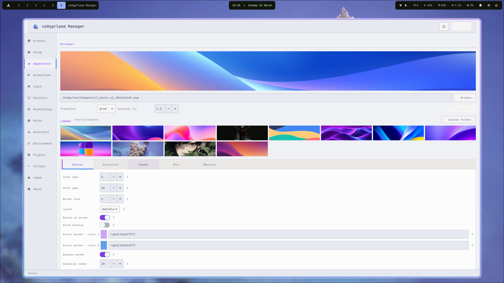
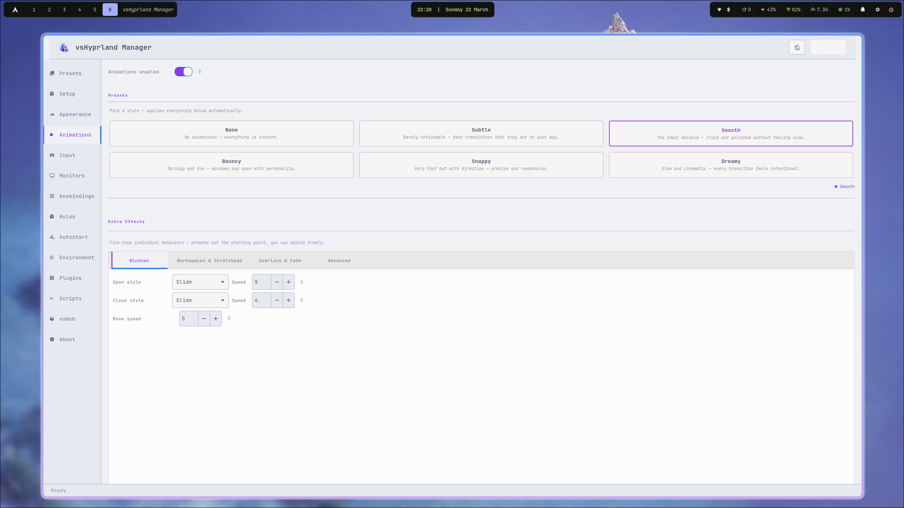
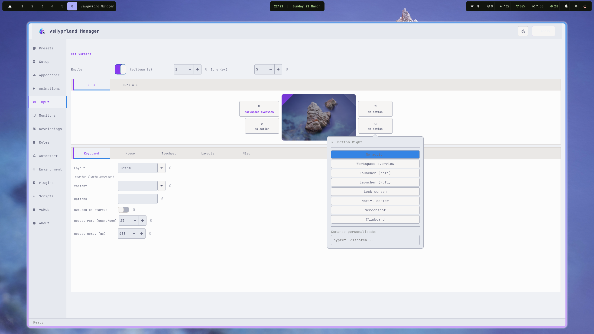
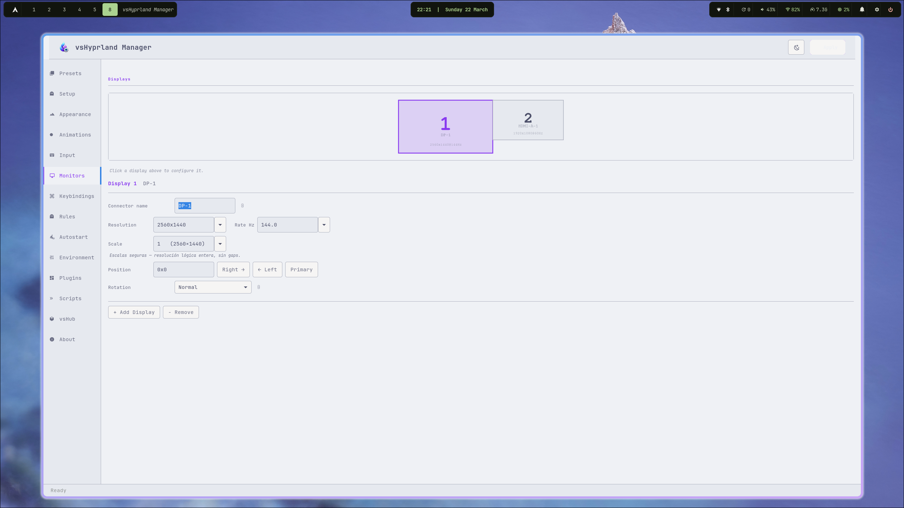
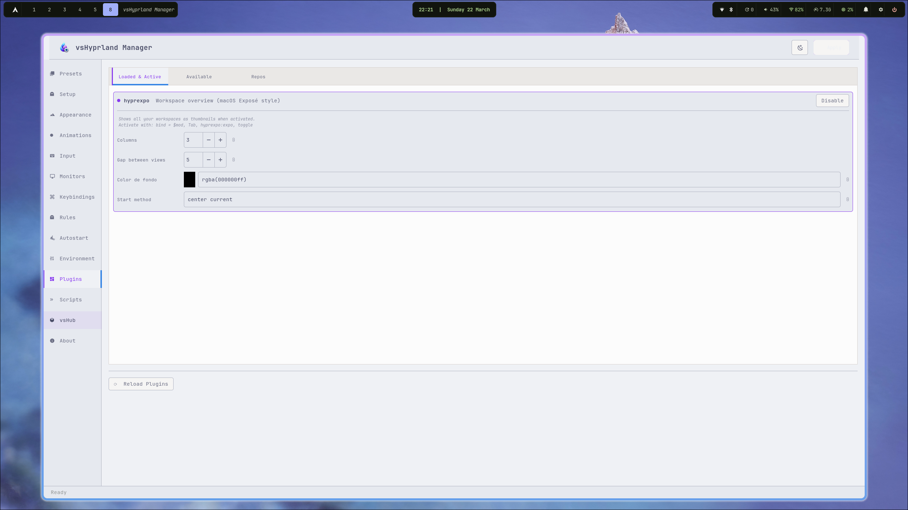

<p align="center">
  
</p>

<h1 align="center">vsHyprland Manager</h1>

<p align="center">
  A visual configuration editor for <a href="https://github.com/hyprwm/Hyprland">Hyprland</a> — edit your window manager settings with live preview and modular config files.
</p>

<p align="center">
  <a href="LICENSE"></a>
  <a href="https://aur.archlinux.org/packages/vshyprland-manager"></a>
</p>

No more editing `hyprland.conf` by hand. Design your desktop with a structured interface and apply changes instantly.

> Single-file Python 3 + GTK3 application. Part of the vsHyprSettings suite.

---

## Screenshots

| Appearance | Animations |
|---|---|
|  |  |

| Input & Hot Corners | Monitors |
|---|---|
|  |  |

| Plugins |
|---|
|  |

---

## Features

- **Live preview strip** — Cairo-rendered mock windows showing your active border gradient, rounding, shadow and inactive window styling in real time
- **Appearance** — gaps, border size, rounding, active/inactive border colors (rgba gradient), opacity, shadow, blur, XWayland options; wallpaper managed via your desktop tool (e.g. swww)
- **Animations** — 6 ready-to-apply presets out of the box (None, Subtle, Smooth, Bouncy, Snappy, Cinematic) plus full manual editor: Bezier curves and animation assignments (name, speed, curve, type)
- **Input** — keyboard layout/options, mouse sensitivity/accel, touchpad tap/scroll, Dwindle and Master layout settings
- **Monitors** — monitor list with resolution, position, scale, transform, and disable toggle
- **Keybindings** — Variables tab (`$VAR = value`) + Keybindings tab (modifier, key, dispatcher, argument) with profile save/load
- **Rules** — Window Rules, Layer Rules, and Blur Layers each in their own tab, with profile save/load
- **Autostart** — `exec-once` command list
- **Environment** — environment variable list (`key = value`)
- **Plugins** — Loaded & Active, Available plugins, and Repos in separate tabs; supports HyprExpo, HyprFocus, Hyprbars, Borders++, Hyprtrails, HyprScrolling, Split Monitor Workspaces, Hyprgrass, Hyprwinwrap
- **Scripts** — built-in editor for auxiliary scripts (`hotcorner.sh`, etc.) with save, reload, run, and backup
- **Hot Corners** — per-corner actions with a Cairo visual monitor diagram
- **vsHub** — discover, launch, and install the full vsHyprSettings suite; fetches updates from GitHub automatically
- **Modular config** — each section writes to its own file; your other includes are untouched
- **Initial backup** — on first run, saves a copy of your original config files to `~/.config/hypr/backups/original/`; never overwritten
- **Apply backups** — every apply creates a timestamped snapshot of all modified files; one-click restore from the About page
- **Dark / Light editor theme** toggle

---

## Requirements

- Python 3.10+
- `python-gobject` (GTK3 bindings)
- `python-cairo`
- [Hyprland](https://github.com/hyprwm/Hyprland)

---

## Tested environment

Developed and tested exclusively on:

| | |
|---|---|
| **Distro** | Arch Linux (clean install via `archinstall`) |
| **Compositor** | Hyprland |
| **AUR helper** | yay |
| **Other** | git |

> **No tests have been run on other distributions** (Fedora, Ubuntu, NixOS, openSUSE, etc.).
> It may work on any distro that runs Hyprland, but nothing is guaranteed outside of Arch.
> Contributions and reports from other environments are welcome.

---

## Installation

### AUR (recommended)

```bash
yay -S vshyprland-manager
```

### Manual

```bash
git clone https://github.com/victorsosaMx/vsHyprland-Manager
cd vsHyprland-Manager
chmod +x vshyprland-manager
./vshyprland-manager
```

---

## Config Structure

vshyprland-manager writes to modular files under `~/.config/hypr/modules/`:

```
~/.config/hypr/
├── modules/
│   ├── appearance.conf   ← General, Decoration, Shadow, Blur, XWayland
│   ├── animations.conf   ← Bezier curves + animation assignments
│   ├── input.conf        ← Keyboard, Mouse, Touchpad, Dwindle, Master, Misc
│   ├── binds.conf        ← $VARIABLES + keybindings
│   ├── rules.conf        ← windowrulev2, layerrule
│   ├── autostart.conf    ← exec-once
│   ├── env.conf          ← env =
│   ├── plugins.conf      ← plugin { hyprexpo { } hyprfocus { } }
│   └── monitors.conf     ← (written to ~/.config/hypr/monitors.conf)
└── backups/
    └── YYYYMMDD_HHMMSS_appearance.conf
    └── ...
```

In your main `hyprland.conf`, include them with:

```
source = ~/.config/hypr/modules/appearance.conf
source = ~/.config/hypr/modules/animations.conf
source = ~/.config/hypr/modules/input.conf
source = ~/.config/hypr/monitors.conf
source = ~/.config/hypr/modules/binds.conf
source = ~/.config/hypr/modules/rules.conf
source = ~/.config/hypr/modules/autostart.conf
source = ~/.config/hypr/modules/env.conf
source = ~/.config/hypr/modules/plugins.conf
```

---

## Backups

### Initial backup (first Apply)

The very first time you hit **Apply**, vshyprland-manager saves a copy of your existing config files to:

```
~/.config/hypr/backups/original/
  appearance.conf   animations.conf   input.conf
  binds.conf        rules.conf        autostart.conf
  env.conf          plugins.conf      monitors.conf
  hyprland.conf
```

This folder is **never overwritten**. You can open it or restore your originals at any time from the **About** page.

### Apply backups (every save)

Every **Apply** also creates a timestamped snapshot of all modified files:

```
~/.config/hypr/backups/
  20260321_143022_appearance.conf
  20260321_143022_input.conf
  ...
```

---

## Acknowledgements

### Core

- [Hyprland](https://github.com/hyprwm/Hyprland) by Vaxry — the Wayland compositor this editor configures
- [hyprpm](https://wiki.hyprland.org/Plugins/Using-Plugins/) — Hyprland's built-in plugin manager
- [GTK3](https://www.gtk.org/) / [PyGObject](https://gitlab.gnome.org/GNOME/pygobject) — GUI toolkit and Python bindings
- [PyCairo](https://pycairo.readthedocs.io/) — 2D graphics (monitor diagram, hot corners)
- [JetBrains Mono Nerd Font](https://github.com/ryanoasis/nerd-fonts) — monospace font used throughout

### Hyprland plugins

- [HyprExpo](https://github.com/hyprwm/hypr-contrib) — workspace overview (macOS Exposé style)
- [HyprFocus](https://github.com/VortexCoyote/hyprfocus) — focus animation when switching windows
- [Hyprbars](https://github.com/hyprwm/hyprland-plugins) — title bars for floating windows
- [Borders++](https://github.com/hyprwm/hyprland-plugins) — extra decorative borders
- [Hyprtrails](https://github.com/hyprwm/hyprland-plugins) — cursor trail effect
- [HyprScrolling](https://github.com/dawsers/hyprscroller) — scrolling layout
- [Split Monitor Workspaces](https://github.com/Duckonaut/split-monitor-workspaces) — per-monitor workspace isolation
- [Hyprgrass](https://github.com/horriblename/hyprgrass) — touchscreen gesture support
- [Hyprwinwrap](https://github.com/hyprwm/hyprland-plugins) — use any app as wallpaper

### Desktop environment

- [Waybar](https://github.com/Alexays/Waybar) — status bar
- [hyprpaper](https://github.com/hyprwm/hyprpaper) — wallpaper daemon (static)
- [swww](https://github.com/LGFae/swww) — wallpaper daemon (animated transitions)
- [SwayNotificationCenter (swaync)](https://github.com/ErikReider/SwayNotificationCenter) — notification center
- [Rofi](https://github.com/davatorium/rofi) — application launcher and dmenu
- [wofi](https://hg.sr.ht/~scoopta/wofi) — Wayland-native application launcher
- [Kitty](https://github.com/kovidgoyal/kitty) — terminal emulator
- [Dolphin](https://apps.kde.org/dolphin/) — file manager
- [hyprlock](https://github.com/hyprwm/hyprlock) — screen locker
- [wlogout](https://github.com/ArtsyMacaw/wlogout) — logout / power menu
- [hyprswitch](https://github.com/h3rmt/hyprswitch) — window switcher (Alt+Tab)
- [grimblast](https://github.com/hyprwm/contrib) / [grim](https://sr.ht/~emersion/grim/) + [slurp](https://github.com/emersion/slurp) — screenshots
- [cliphist](https://github.com/sentriz/cliphist) + [wl-clipboard](https://github.com/bugaevc/wl-clipboard) — clipboard manager
- [Polkit GNOME](https://gitlab.gnome.org/Archive/gnome-common) — authentication agent
- [blueman](https://github.com/blueman-project/blueman) — Bluetooth manager
- [udiskie](https://github.com/coldfix/udiskie) — automount daemon
- [pamixer](https://github.com/cdemoulins/pamixer) — volume control
- [playerctl](https://github.com/altdesktop/playerctl) — media player control
- [brightnessctl](https://github.com/Hummer12007/brightnessctl) — display brightness
- [PipeWire](https://pipewire.org/) + [WirePlumber](https://pipewire.pages.freedesktop.org/wireplumber/) — audio subsystem
- [xdg-desktop-portal-hyprland](https://github.com/hyprwm/xdg-desktop-portal-hyprland) — screen sharing, file picker
- [Flatpak](https://flatpak.org/) — sandboxed app support
- [yay](https://github.com/Jguer/yay) / [paru](https://github.com/Morganamilo/paru) — AUR helpers (used by vsHub to install tools)

---

## ⚠️ Disclaimer

vsHyprland Manager reads and **writes** your Hyprland configuration files. While it creates automatic backups before every change, there is always a risk of data loss or misconfiguration — especially on untested setups.

- **Back up your `~/.config/hypr/` folder before first use**
- This software is provided **as-is**, with no warranty of any kind
- The author is not responsible for broken configs, lost settings, or any damage to your system
- Always verify your config works after applying changes (`hyprctl reload`)

> Tested only on Arch Linux + Hyprland. Use on other distributions at your own risk.

---

## License

MIT — do whatever you want, credit appreciated.

---

*Part of the [vsHyprSettings](https://github.com/victorsosaMx/vsHyprSettings) suite.*
